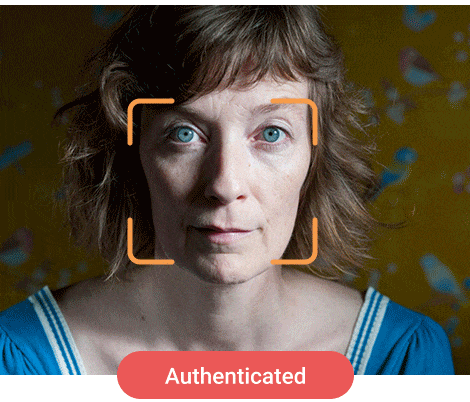

# MBA FIAP Inteligência Artificial & Machine Learning

Obtenha mais informações sobre a formação em inteligência artificial e a ementa completa no [portal](https://www.fiap.com.br/mba/mba-em-artificial-intelligence-e-machine-learning/) da FIAP.

## Visão Computacional Capstone

### Detector de Liveless

Uma determinada fintech focada em consumidores finais pessoa física constataou um grande número de fraudes em transações bancárias.

O setor de fraudes apontou que existem clientes que se queixaram de não contratar serviços específicos, como o crédito pessoal, e após isso transferir para outras contas desconhecidas. 

Após análises pelas equipes de segurança, os protocolos de utilização da senha foram realizados em conformidade, ou seja, cada cliente autenticou com sua própria senha de maneira regular.

Em função disso, o banco precisa arcar com reembolsos e medidas de contenção para evitar processos judiciais, pois os clientes alegam terem sido invadidos por hackers ou algo parecido.

Uma das formas de solucionar ou minimizar este problema é com a utilização de outras formas de autenticação, sobretudo em operações críticas, como a obtenção de crédito pessoal.

Desta forma podemos implementar uma verificação de identidade com prova de vida (liveness), que utilize uma verificação e identificação facial. 

Caso o cliente não seja autenticado, ele será atendido por uma esteira dedicada e as evidências da não identificação serão encaminhadas para a área de IA para validação dos parâmetros e limiares para aperfeiçoamento do modelo.

<p align="center">
    
</p>

Imagem obtida da [Chooch.ai](https://chooch.ai/computer-vision/face-authentication-system-with-liveness-detection-security/).


## 1. Instruções

Nas aulas utilizaremos a distribuição Ananconda, com uso intensivo do Jupyter Notebook, que há vem instalado nesta distribuição.

Para instalar, acesse a sessão de [Downloads](https://www.anaconda.com/download) do Anaconda.


### 2. Repositório

Recomendamos clonar este repositório.

>**Importante**: como serão desenvolvidos modelos com arquivos grandes, é necessário ter um arquivo ```.gitignore``` com o seguinte conteúdo:

```
projeto/pesos/*
!projeto/pesos/.gitkeep 

projeto/modelos/*
!projeto/modelos/.gitkeep 

projeto/classificadores/*
!projeto/classificadores/.gitkeep 

projeto/.ipynb_checkpoints

.DS_Store
````

### 3. Template guiado

[](https://colab.research.google.com/github/michelpf/fiap-ml-visao-computacional-detector-liveness/blob/master/notebook/deteccao-liveness-notebook.ipynb)

> **Atenção: o grupo/aluno que não utilizar este template (ou alterar partes indevidas) será automaticamente reprovado.**

### 4. Bibliotecas utilizadas

Este projeto requer **Python 3.5 ou superior** e as seguintes bibliotecas:

- [NumPy](http://www.numpy.org/)
- [matplotlib](http://matplotlib.org/)
- [seaborn](http://seaborn.pydata.org/)
- [Keras](https://keras.io/)
- [Tensorflow](http://tensorflow.org/)
- [Pillow](https://pillow.readthedocs.io/en/stable/)


### 5. Critérios de avaliação

O projeto será avaliado pelos seguintes itens abaixo. A nota final será uma composição levando em consideração o peso de cada tema.

- Abordagem e organização da solução do problema (2 pontos)
- Organização de dados para treinamento de modelo de liveness (2 pontos)
- Treinamento de modelo de liveness (1,5 pontos)
- Métricas de desempenho do modelo (2 pontoS)
- Implementação de solução no Streamlit (+1 ponto adicional, template se encontra na pasta streamlit-app e deve ser complementado para incluir o modelo e demais etapas)
- Conclusões (2,5 pontos)